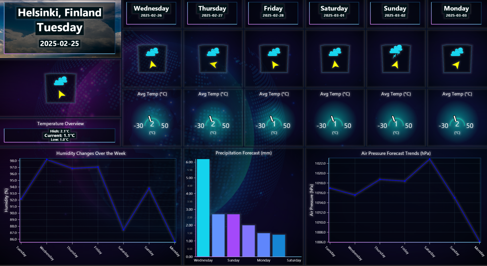

# Historical Weather Application with LightningChart Python & Open-Meteo

## Introduction to the Project
This project develops a Historical Weather Application using LightningChart Python and Open-Meteo API to visualize historical, real-time and forecasting weather data. The goal is creating an interactive dashboard that provides different weather parameters like temperature, humidity, wind speed, pressure, and precipitation trends for Helsinki, Finland.

## About the Dataset and Open-Meteo
We used **Open-Meteo’s Historical Weather API**, which provides past and real-time weather data. Open-Meteo offers free weather data with high precision and supports multiple weather parameters such as:
- Temperature (°C)
- Precipitation (mm)
- Wind Speed and Direction (km/h, °)
- Humidity (%)
- Soil Moisture and Soil Temperature (for deeper insights)
- Air Pressure
- Cloud Coverage

The dataset covers the **past 24 hours** and provides **hourly forecasts**, that makes it ideal for monitoring weather patterns.

---

## LightningChart Python
### Overview of LightningChart Python
LightningChart Python is a high-performance data visualization library that offers **real-time and different interactive charting**. It allows the creation of **2D and 3D visualizations** that makies it ideal for real-time weather monitoring.

### Features and Chart Types Used in This Project
In this project, we used several LightningChart components:
- **Gauge Chart:** Displays real-time temperature.
- **Polar Chart:** Shows wind direction and speed.
- **3D Chart:** Visualizes weather conditions dynamically.
- **Bar Chart:** Represents soil temperature, moisture, and cloud coverage.
- **Multi-Line Chart:** Monitors environmental trends like pressure, humidity, and wind speed.

### Performance Characteristics
LightningChart Python provides:
- **GPU acceleration** that enables smooth visualization even with large datasets.
- **Real-time updates** which makes it ideal for monitoring live weather changes.
- **Low CPU and memory usage** which improves dashboard responsiveness.

---

## Setting Up Python Environment
### Installing Python and Necessary Libraries
Before running the project, install Python and the other required libraries using:
```bash
pip install requests pandas lightningchart trimesh pytz
```

### Overview of Libraries Used
- **NumPy & Pandas**: For handling and processing weather data.
- **LightningChart**: To create interactive visualizations.
- **Trimesh**: For 3D weather condition models.
- **Requests**: To fetch data from the Open-Meteo API.
- **pytz**: To manage timezone conversions.

### Setting Up the Development Environment
1. Set up a virtual environment:
```bash
python -m venv env
source env/bin/activate  # On Windows use `env\Scripts\activate`
```
2. Use **Visual Studio Code (VSCode)** for a streamlined development experience.

---

## Loading and Processing Data
### Fetching Data from Open-Meteo API
We fetch the weather data using the following function:
```python
def fetch_weather_data():
    API_URL = "https://api.open-meteo.com/v1/forecast"
    params = {
        "latitude": 60.1699,
        "longitude": 24.9384,
        "hourly": "temperature_2m,precipitation,wind_speed_10m",
        "past_days": 1,
        "forecast_days": 0,
        "timezone": "auto",
    }
    response = requests.get(API_URL, params=params)
    return pd.DataFrame(response.json()["hourly"])
```

### Handling and Preprocessing Data
- Convert timestamps to local Helsinki time.
- Handle missing values and outliers.
- Aggregate hourly data for daily analysis.

---

## Visualizing Data with LightningChart
### Creating Charts
Here are some examples that shows how we created key visualizations:

#### **Wind Direction & Speed (Polar Chart)**
```python
polar_chart = dashboard.PolarChart(column_index=0, row_index=0, row_span=4, column_span=4)
polar_chart.set_title("Current Wind Direction & Speed")
polar_chart.add_heatmap_series(sectors=12, annuli=5)
```

#### **Real-Time Temperature (Gauge Chart)**
```python
gauge_chart = dashboard.GaugeChart(column_index=10, row_index=0, row_span=4, column_span=2)
gauge_chart.set_title("Current Temperature (°C)")
gauge_chart.set_interval(start=-30, end=50).set_value(0)
```

#### **3D Weather Condition Visualization**
```python
chart_3d = dashboard.Chart3D(row_index=0, column_index=8, row_span=4, column_span=2)
chart_3d.set_title("Current Weather Condition")
chart_3d.set_camera_location(0, 1, 5)
```

#### **Environmental Data Trends (Multi-Line Chart)**
```python
line_chart = dashboard.ChartXY(column_index=4, row_index=4, row_span=4, column_span=8)
line_chart.set_title("Environmental Data Trends")
series = line_chart.add_line_series(data_pattern="ProgressiveX")
```
  
  

### Customizing Visualizations
- **Color Palettes**: Used different gradient colors to show better data intensities.
- **Legends & Labels**: Improved readability of weather parameters.

---

## Conclusion
This project demonstrates how to leverage **LightningChart Python** with **Open-Meteo** API to visualize a **real-time, historical and forecasting weather monitoring system**. The dashboard visualizes weather trends that enable us to improve data-driven decision-making for weather analysis.

